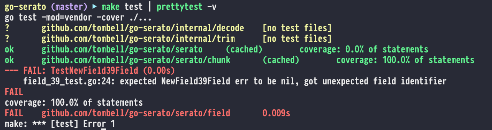

# prettytest

Adds color to the output of `go test` on macOS or Linux systems.

## Installation

To get the most up to date binaries, check [the releases][releases] for
the pre-built binary for your system.

You can also `go get` to install from source.

    go get github.com/tombell/prettytest

[releases]: https://github.com/tombell/coin/releases

On macOS you can use [Homebrew](https://brew.sh) to install.

    brew tap tombell/formulae && brew install prettytest

## Usage

Pipe the output from running `go test` into `prettytest` to get the colorized
output.

    go test ./... | prettytest

This will filter out lines from the output that include `[no test files]` to
keep the output simple. If you want to see this output, you can add the `-v`
flag.

    go test ./... | prettytest -v

That is all there is to it!
